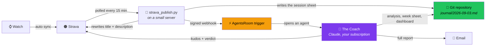
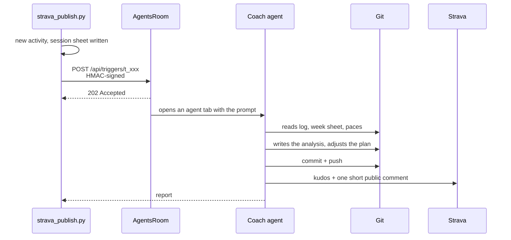

# 🏃 Running Performance Coach

**A real running coach that watches your training, writes your plan, and talks
back to you — built from a Git repository, one Claude subscription, and
[AgentsRoom](https://agentsroom.dev).**

No app to build. No server to write. No API bill. You finish a run, and a few
minutes later the analysis is in your repository, the plan for the coming week
has been adjusted, and a comment from your coach is sitting under the activity on
Strava.

> This is a **template**. Clone it, fill in who you are and what you're aiming
> for, and you have your own coach. Everything in `{{DOUBLE_BRACES}}` is a
> placeholder waiting for you.

---

## What actually happens

You run. Your watch syncs to Strava. Then, without you touching anything:



Three things are worth pausing on.

**The log is a Git repository, not a database.** Every session is a Markdown
file. Every plan change is a commit. Which means the coach can *read its own
history* — it knows what it prescribed three weeks ago and whether it worked —
and you can read your training on your phone in the GitHub app.

**The coach is an agent, not a chatbot.** It doesn't wait for you to ask. A
finished activity wakes it up, and it works through a checklist it was given
once, in [`CLAUDE.md`](CLAUDE.md).

**It costs what your Claude subscription costs.** There is no API key metered per
token here. AgentsRoom runs the agent under your existing plan.

---

## What you need

| | Why |
|---|---|
| **A Claude subscription** | Pro or Max. This is what runs the coach. |
| **[AgentsRoom](https://agentsroom.dev)** | Gives the agent a home: a persona, a trigger, a browser, a memory. |
| **A Strava account** | Where your watch already sends your runs. |
| **A Strava API application** | Free to create. ⚠️ See the note on the paid tier below. |
| *(optional)* **A small always-on machine** | A €5 VPS or a Raspberry Pi, to poll every 15 minutes. |

> ⚠️ **Strava's API has required a paid developer subscription since June 2026**
> (Standard Tier). Without it, every call answers `403 Application Status
> Inactive`. The fallback — importing a TCX file exported from your watch — is
> supported out of the box by [`scripts/import_tcx.py`](scripts/import_tcx.py),
> and everything downstream of the import works identically.

---

## The three automations

They are independent. You can adopt one and ignore the others.

### 1. Strava → your log

[`scripts/strava_sync.py`](scripts/strava_sync.py) turns an activity into a
pre-filled session sheet: laps, splits, heart rate, cadence, gear. It fills only
what was **measured**, and leaves "Feel" and "Analysis" empty — those are yours
and the coach's.

The interesting part is that it **reconstructs the shape of the session** from
the raw laps. Your watch records eleven laps; the script works out that this was
`5 × 1000 m with 2 min recovery`, and which laps were the repetitions:

```
Lap 1  : 4.40 km in 26'07 (5:56/km)   ← warm-up
Lap 2  : 1.00 km in 3'41  (3:41/km)   ← rep 1
Lap 3  : 0.20 km in 1'59  (9:55/km)   ← recovery
...                                     → "5 x 1000m r' 2'"
```

It does this by trying every split of the form *"the k fastest laps are the
repetitions"* and keeping the best valid one. Naive clustering does not work
here, and [`scripts/README.md`](scripts/README.md) explains why.

### 2. Your log → Strava

[`scripts/strava_publish.py`](scripts/strava_publish.py) writes the title and
description back onto the activity, from the same reconstruction. Your Strava
feed stops saying *"Afternoon Run"* and starts saying what you actually did.

Two rules are hard-coded and should stay that way:

- **the description never copies your plan's text** — your week sheet contains
  target heart rates, niggles and trade-offs that have no business on a public
  activity;
- **a description you wrote by hand is never overwritten.**

### 3. Strava → the coach

This is the one that changes how the whole thing feels.

When `strava_publish.py` has logged a session, it fires an **outgoing webhook**
at an AgentsRoom **trigger**. The trigger opens a Claude agent, hands it the
session, and that agent does the coaching work: reads the log, compares against
the target paces, writes the analysis, adjusts the week, regenerates the
dashboard, commits, pushes — then leaves a kudos and a short verdict as a comment
on Strava, and emails you the long version.



---

## How the coach is configured

Three layers, and it matters that they are separate.

### Layer 1 — the persona: *who* it is

A system prompt attached to the agent in AgentsRoom. It carries the coaching
philosophy: how to read a session, when to prescribe, how to talk about race
predictions. It is deliberately **generic to the sport** — it would coach anyone.
See [`docs/coach-persona.md`](docs/coach-persona.md).

### Layer 2 — `CLAUDE.md`: *how it works here*

The contract, read at the start of every session:

- the file layout, and the rules that keep it consistent;
- **the ritual** — the exact sequence to run when a session is reported;
- the training principles that constrain every proposal;
- what the agent must never do.

This is where the coach stops being a chatbot. It doesn't improvise a workflow
each time; it follows one you wrote once. [`CLAUDE.md`](CLAUDE.md) is the file
you'll spend the most time on, and the one worth reading first.

### Layer 3 — the trigger prompt: *what to do right now*

The message handed to the agent when a session lands. It receives the activity
through template variables — `{{event.title}}`, `{{event.body}}`,
`{{event.url}}` — so the agent starts with the session already in hand instead of
going to look for it.

The full prompt is in [`docs/trigger-prompt.md`](docs/trigger-prompt.md). Its
shape:

```markdown
New session imported from Strava.

**{{event.title}}** — activity `{{event.id}}`
{{event.url}}

{{event.body}}

---

⚠️ You are running unattended: nobody will read a question.

## 1 · Analyse and adjust the plan
   git pull, read the log + week sheet + target paces + the last 3 sessions,
   write the `## Analysis` section, update the week, regenerate the README,
   commit and push.

## 2 · Kudos and comment on Strava
   ⛔ A Strava comment is PUBLIC: no target HR, no niggle, no internal
   trade-off, no predicted finishing time.

## 3 · Email the full report
```

### Which model, and why

| | |
|---|---|
| **Model** | Claude Opus, 1M-token context |
| **Reasoning effort** | High |
| **Permission mode** | Autonomous — an unattended run has nobody to approve a push |
| **Browser access** | On — it needs it for Strava and webmail |

The long context is not a luxury here. To judge one session properly the coach
reads the session sheet, the week sheet, the pace table and the previous three
sessions — a session is never judged alone.

---

## Set it up

### 1. Clone and make it yours

```bash
git clone https://github.com/AgentsRoomDev/running-performance-coach.git my-coach
cd my-coach
rm -rf .git && git init
```

> 🔒 **Make your copy private.** A training log holds health data — heart rate,
> sleep, injuries. This template is public; your log should not be.

Then fill in, in order:

1. [`athlete/profile.md`](athlete/profile.md) — who you are as a runner
2. [`athlete/records.md`](athlete/records.md) — your PBs
3. [`athlete/constraints.md`](athlete/constraints.md) — the slots you *actually* have
4. [`athlete/zones-and-paces.md`](athlete/zones-and-paces.md) — your reference paces
5. [`plan/objective.md`](plan/objective.md) — the race and the target
6. [`CLAUDE.md`](CLAUDE.md) — replace every `{{PLACEHOLDER}}`

Then open the repository with your Claude agent and say: *"read CLAUDE.md and
athlete/, then build me the first week."*

### 2. Connect Strava

```bash
cp .env.example .env && chmod 600 .env
python3 scripts/strava_oauth.py     # one browser click, once
python3 scripts/strava_sync.py --dry-run
```

Full walkthrough, including how to get the refresh token and which scopes you
need: [`scripts/README.md`](scripts/README.md).

### 3. Create the AgentsRoom trigger

In AgentsRoom → **Triggers** → *New trigger*:

| Field | Value |
|---|---|
| Kind | **Webhook**, source `generic` |
| Prompt | the content of [`docs/trigger-prompt.md`](docs/trigger-prompt.md) |
| Role / persona | [`docs/coach-persona.md`](docs/coach-persona.md) |
| Permission mode | **Autonomous** |
| Browser access | **On** |

AgentsRoom mints a URL and a signing secret. Put both in your `.env`:

```dotenv
WEBHOOK_URL=https://agentsroom.dev/api/triggers/t_xxxxxxxxxxxx
WEBHOOK_SECRET=whsec_xxxxxxxxxxxxxxxxxxxxxxxx
```

### 4. Test it before trusting it

```bash
python3 scripts/webhook_replay.py scripts/examples/webhook-session.json --dry-run
python3 scripts/webhook_replay.py scripts/examples/webhook-session.json
```

This replays a session into the trigger without waiting for your next run, and
without touching the state of the live job. You should see `✅ HTTP 202`, and an
agent tab should open in AgentsRoom.

> ⚠️ The endpoint **rejects unsigned calls** (`{"error":"REJECTED","message":
> "Signature missing."}`). The signature is an HMAC-SHA256 over the **exact bytes
> sent**, in the `X-AgentsRoom-Signature` header. Sign a file and then let another
> layer re-serialise the object and you get a valid signature for a body the
> server will never receive — an undebuggable rejection.
> `webhook_replay.py` avoids this by signing and sending in the same place.

### 5. Run it every 15 minutes

```bash
bash scripts/systemd/install.sh          # on a Linux server
```

A `oneshot` unit plus a timer: no resident process, and a missed pass while the
machine was off is caught up on the next boot.

---

## The comment on Strava

The point is not self-congratulation. It is that **the coach's verdict is
readable from your phone, under the activity, without opening the repository** —
and that it stays there, attached to the session, forever.

So the comment is deliberately narrow: a verdict emoji, the number that carries
it, and what it changes for the next session. Around 250 characters.

> ✅ Five reps at 3'39 average for a 3'38-3'44 target, and heart rate flat across
> the whole block. The pace table holds. Friday stays easy — you've spent this
> week's margin.

The long version — the one with heart rates, the niggle you mentioned, the
arbitration on next week's volume — goes in the log and in the email. Two
channels, two audiences, and the prompt keeps them separate.

---

## What this costs, and where it runs

| Piece | Where | Cost |
|---|---|---|
| The coach agent | Your machine, via AgentsRoom | your Claude subscription |
| The 15-minute poll | A small always-on Linux box | ~€5/month, or free on a Pi |
| The log | A private Git repository | free |
| Strava API | Strava Developer Program | see Strava's pricing |

The polling job makes **one API request per pass** in steady state — 96 a day
against a 3 000/day ceiling.

---

## Make it yours

This template coaches a 10 km runner. Nothing about it is specific to that:

- **Another distance?** Rewrite [`plan/strategy.md`](plan/strategy.md) and
  [`plan/session-types.md`](plan/session-types.md).
- **Another sport?** The import reconstructs *laps*. Cycling and swimming record
  laps too.
- **Another language?** Set `{{LANGUAGE}}` in `CLAUDE.md`. The coach writes in
  whatever you tell it to.
- **No Strava?** Drop the scripts and tell the agent about your sessions in
  conversation. The ritual in `CLAUDE.md` works identically — you lose the
  automation, not the coach.
- **Another training philosophy?** §9 of `CLAUDE.md` is deliberately opinionated.
  Disagree with it in writing, and the coach will follow you.

---

## Documentation

| | |
|---|---|
| [`CLAUDE.md`](CLAUDE.md) | The coach's operating manual — **start here** |
| [`docs/architecture.md`](docs/architecture.md) | How the pieces fit, and why |
| [`docs/trigger-prompt.md`](docs/trigger-prompt.md) | The full trigger prompt, commented |
| [`docs/coach-persona.md`](docs/coach-persona.md) | The coaching system prompt |
| [`scripts/README.md`](scripts/README.md) | Strava setup, OAuth, the automated job |
| [`journal/README.md`](journal/README.md) | How a session sheet is filled |

---

## License

MIT. Do what you like with it.

Built with [AgentsRoom](https://agentsroom.dev) and [Claude](https://claude.ai).
