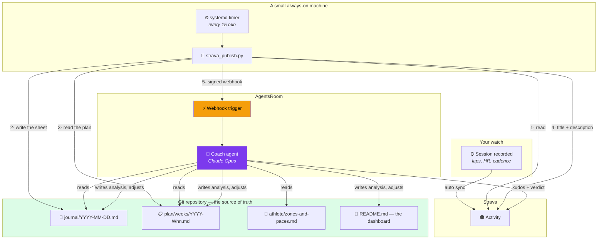
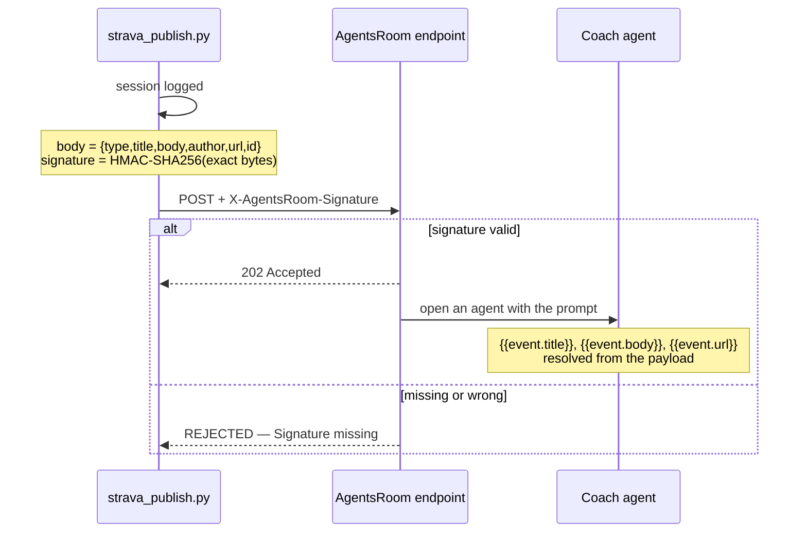

# Architecture

> 📖 **New here?** Start with the walkthrough — [How I built my own AI running coach](https://agentsroom.dev/blog/build-your-own-ai-running-coach)

How the pieces fit, and — more usefully — **why they fit that way**. Most of the
decisions below exist because a simpler version was tried first and broke.

---

## The whole thing on one page



---

## Decision 1 — the log is a Git repository, not a database

Every session is a Markdown file. Every plan change is a commit.

**Why it matters more than it looks.** The coach can read its own history: what
it prescribed three weeks ago, whether the athlete held the pace, which
adjustment it already tried. A database row would give it the same data and none
of the reasoning — the commit history *is* the longitudinal record of the
project.

Three consequences that are all upside:

- the athlete reads their plan on their phone, in the GitHub app, with no app to
  build;
- an analysis is diffable — you can see exactly what the coach changed;
- the whole thing works offline, and survives every tool it was built with.

## Decision 2 — one file per day, one file per week, one file per activity

```
journal/2026/2026-09-03.md         one training day
plan/weeks/2026-W36.md             one week
data/derived/activities/<id>.json  one activity
```

Never a shared file that everything appends to. Two machines importing different
sessions add **different files**, which Git merges without conflict. A shared CSV
makes the same lines diverge and produces a conflict on every pass.

The CSV aggregate still exists — but it is **derived and not versioned**. It is
regenerated from the per-activity files whenever anyone needs it.

## Decision 3 — the importer never judges

| | |
|---|---|
| ✅ The job fetches activities | and creates the session sheet |
| ✅ It writes title and description on Strava | and commits what it created |
| ⛔ It does not fill `## Analysis` | that is coaching work |
| ⛔ It touches neither the week sheet nor the paces | even when the gap is glaring |

This separation is what keeps the system trustworthy. An import that also
"helpfully" adjusted your plan would be impossible to audit: you could never tell
whether Tuesday changed because of a coaching decision or a parsing accident.

Analysis happens in a conversation — or through the coach trigger, which is a
conversation the webhook starts for you.

## Decision 4 — idempotence lives on Strava, not in a state file

The job may run on several machines. How does one know what the other already
did?

It does not need to. **The description on Strava is the source of truth.** The
lines the script always writes act as a signature:

| Description | Verdict |
|---|---|
| Empty | write it |
| Carries the signature | already done, leave it |
| Non-empty, no signature | ⛔ written by the athlete — never touch |

A local state file could not have said anything about what another machine did.
The one that exists (`data/inbox/publish-state.json`) is purely a cost-saving
cache: deleting it breaks nothing, it just makes the next pass more expensive.

## Decision 5 — the shape of a session is read from the watch, not from the plan

The watch records eleven laps. The plan says `5 × 1000 m`. It would be easy —
and wrong — to trust the plan: the whole point is to detect **when the athlete
did something else**.

So the structure is reconstructed from the laps alone, then compared with the
plan. When they disagree, that disagreement is the finding:

```
🎯 Planned 3 x 8' → run continuously
```

The algorithm and the two failed approaches that preceded it are documented in
[`../scripts/README.md`](../scripts/README.md).

## Decision 6 — three separate configuration layers for the coach

| Layer | Where it lives | Answers | Changes |
|---|---|---|---|
| **Persona** | AgentsRoom system prompt | who the coach is | almost never |
| **`CLAUDE.md`** | the repository | how it works here | every few weeks |
| **Trigger prompt** | AgentsRoom trigger | what to do right now | when the workflow changes |

Keeping them apart is what makes the coach portable. The persona would coach
anyone; `CLAUDE.md` is what makes it *yours*; the trigger prompt is a procedure,
not a personality.

It also means you can debug them independently. Bad tone → persona. Wrong file
written → `CLAUDE.md`. Step skipped in the automated run → trigger prompt.

## Decision 7 — public and private channels are separated in writing

The coach writes to three destinations, and they do not carry the same content:

| Destination | Audience | May contain |
|---|---|---|
| `journal/` + `README.md` | the athlete, in a private repository | everything |
| Email | the athlete | everything |
| **Strava comment / description** | **everyone** | ⛔ verdict and public numbers only |

No target heart rates, no niggles, no internal trade-offs, no predicted finishing
times on Strava. This is stated in `CLAUDE.md`, restated in the trigger prompt,
and hard-coded in `strava_publish.py` — three times, because it is the rule with
the worst consequences if it slips.

---

## The webhook, in detail



**The payload contract is exactly `{type, title, body, author, url, id}`.** No
custom keys: an unexpected field may be rejected, and everything that matters
fits in `body` — which is what the agent reads anyway.

⛔ **The plan's text never enters the payload.** It carries the *code* of the
planned session and the *path* of the sheets. An agent that has the repository
reads them itself; an agent that does not has no business receiving the
athlete's internal instructions.

Three properties the implementation guarantees:

1. **Never blocking.** An endpoint that is down must not prevent a session from
   being imported. Failures are logged and retried on the next pass.
2. **Fired after logging, not after the Strava write.** The receiver wants to
   know a session exists, including when the description was hand-written and
   left untouched.
3. **Once per activity.** The delivery id is stable per activity
   (`strava-<id>`), so a receiver can deduplicate even if the job runs on two
   machines.

---

## What runs where

| Piece | Where | Why there |
|---|---|---|
| 15-minute poll | a small always-on Linux box | laptops sleep and change networks |
| Coach agent | the athlete's machine, via AgentsRoom | it needs a browser and the repository |
| The log | a **private** Git repository | it contains health data |
| Credentials | `.env`, `chmod 600`, never versioned | one file, one machine, one owner |

> 🔒 The template you cloned is public. **Your copy must not be.** A training log
> holds heart rate, sleep, injuries and weight. That is health data, and a public
> repository does not forget — forks, caches and archives outlive a deletion.
